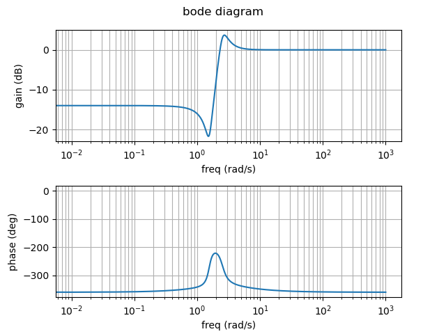
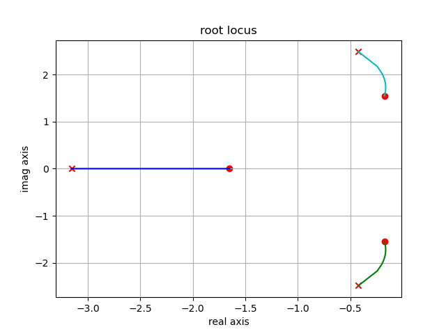

`control.py` contains simple implementations of bode diagram and root locus methods, which are used to analyse the frequency response and stability of a control system, along with a handy pid controller.

#### bode diagram

#### root locus

